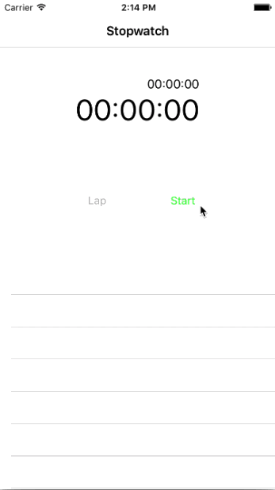

Stopwatch
==========
Stopwatch is a Swift App developed on XCode that measures amount of time elapsed from a particular time. It simulates and mocks Apple's offical App called Clock. This app supports functions such as lap record, time resume, and stopwatch reset.

## Screenshots

